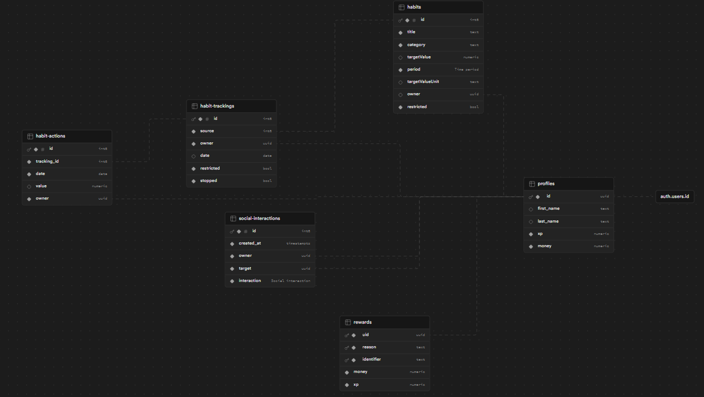

<a href="https://prod-individual-paranoidphantom.vercel.app/" target="_blank">
	
</a>

# [Choco-Pie Лайф](https://prod-individual-paranoidphantom.vercel.app/)

> Чтобы не тратить ваше время я создал учётную запись - admin@prod | PROD2024WASAWESOME

## Маленький исторический экскурс (буквально на пару минут)

Данный проект вероятно отличается от других, потому-что у него реализован бекенд и интеграция с базой данных.

### Проект:

-   Имеет механизмы безапасности (RLS policies)
-   Также имеет статичную типизацию самой базы данных (за счёт Supabase CLI)
-   Легко деплоиться на свой сервер вместе с базой данных через простой docker compose.

### **Так как я долго делал интеграцию с БД я многое к сожелению не успел, это бесспорно моё упущение.**

### Экстрафичи:

-   Настоящая авторизация с отправкой письма на почту
-   Кастомные аватарки хранящиеся на сервере
-   Полноценная система друзей - запросы, добавление, удаление из друзей
-   Полноценная светлая и тёмная тема (переключение между ними)
-   SSR за счёт Nuxt 3
-   Realtime многих частей приложение за счёт WebSocket (например вкладка друзья)

### Также ОЧЕНЬ прошу учесть то что т.к. задание выполнено не совсем стандартно, прошу проверять его более вдумчиво и также немного нестандартно. Механизмы загрузки привычек в формате JSON и переключение даты сделано где-то криво, а где-то вообще не сделано. Прошу отнестись с пониманием.

Я понимаю что много где сделал упор не туда, и это был полезный опыт.

Если вас заинтересует база данных, можете посмотреть сгенерированные типы в [types/supabase.ts](types/supabase.ts)

Также ниже прикрпляю схему:


---

## Запуск локально

Клон проекта:

```bash
git clone https://github.com/Central-University-IT-prod/frontend-paranoidPhantom.git && cd frontend-paranoidPhantom
```

Установка зависимостей:

```bash
# npm
npm install

# pnpm
pnpm install

# yarn
yarn install

# bun
bun install
```

> В данном случае я убрал .env из .gitignore. Скорее всего это ужасное решение и так не стоит делать никогда, но в данном случае мне показалось что это наиболее простое решение проблемы с credentials по базе данных.

Запуск локальной среды разраюотки `http://localhost:3000`:

```bash
# npm
npm run dev

# pnpm
pnpm run dev

# yarn
yarn dev

# bun
bun run dev
```
